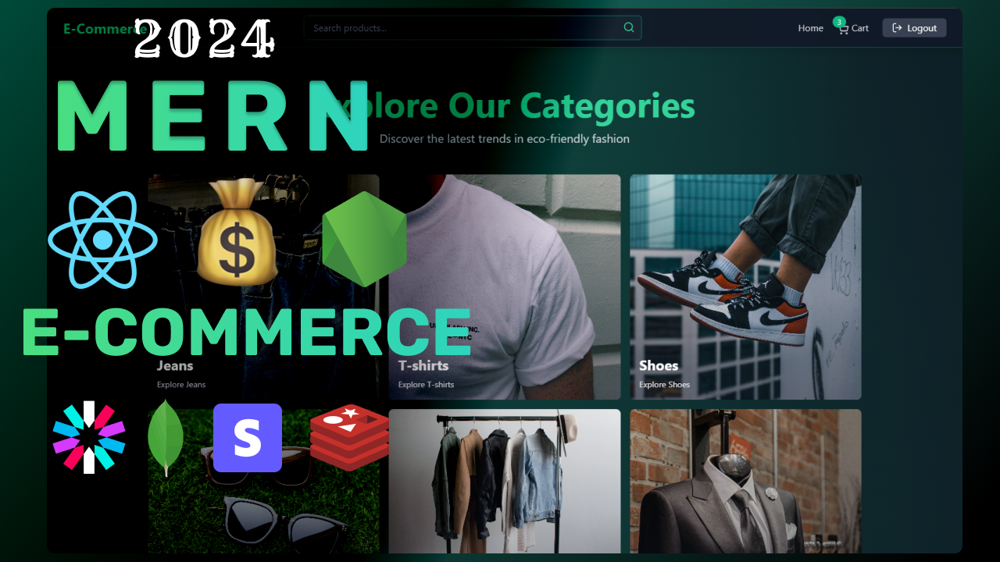

# 🛍️ Sellify - Modern E-commerce Platform

<div align="center">
  
  
  
  
  
  
  
  
  
</div>

## 🌟 Overview

Sellify is a modern, full-stack e-commerce platform built with cutting-edge technologies. It offers a seamless shopping experience with advanced features like real-time analytics, secure payment processing, and an intuitive admin dashboard.

## ✨ Features

### 🛒 Customer Features

- **Product Catalog** - Browse products by categories with beautiful UI
- **Smart Cart Management** - Add, update, and remove items with real-time updates
- **Secure Authentication** - JWT-based authentication with refresh tokens
- **Payment Integration** - Stripe payment processing with checkout sessions
- **Coupon System** - Apply discount coupons for savings
- **Order Management** - Track purchase history and order status
- **Responsive Design** - Mobile-first design with TailwindCSS

### 👨‍💼 Admin Features

- **Product Management** - Create, update, and delete products
- **Analytics Dashboard** - Real-time sales and revenue tracking
- **User Management** - Monitor user registrations and activity
- **Coupon Generation** - Create and manage discount coupons
- **Order Tracking** - View all orders and sales data
- **Image Management** - Cloudinary integration for product images

### 🔧 Technical Features

- **Real-time Data** - Redis caching for optimal performance
- **Secure API** - JWT authentication with middleware protection
- **File Upload** - Cloudinary integration for image management
- **Session Management** - Redis-based session storage
- **Error Handling** - Comprehensive error handling and validation
- **CORS Configuration** - Secure cross-origin requests

## 🏗️ Architecture

### System Architecture

```
┌─────────────────┐    ┌─────────────────┐    ┌─────────────────┐
│                 │    │                 │    │                 │
│   Frontend      │    │   Backend       │    │   Database      │
│   (React)       │────│   (Node.js)     │────│   (MongoDB)     │
│                 │    │                 │    │                 │
└─────────────────┘    └─────────────────┘    └─────────────────┘
         │                       │                       │
         │                       │                       │
         │              ┌─────────────────┐              │
         │              │                 │              │
         └──────────────│   Redis Cache   │──────────────┘
                        │                 │
                        └─────────────────┘
                               │
                    ┌─────────────────┐
                    │                 │
                    │   External      │
                    │   Services      │
                    │                 │
                    │ • Stripe        │
                    │ • Cloudinary    │
                    └─────────────────┘
```

### Application Flow

```
User Authentication Flow:
Login → JWT Token → Redis Storage → Protected Routes → User Dashboard

Shopping Flow:
Browse Products → Add to Cart → Apply Coupons → Checkout → Stripe Payment → Order Confirmation

Admin Flow:
Admin Login → Dashboard → Product Management → Analytics → User Management
```

## 🚀 Tech Stack

### Frontend

- **React 19** - Modern React with hooks and context
- **Vite** - Fast build tool and development server
- **TailwindCSS** - Utility-first CSS framework
- **Framer Motion** - Animation library for smooth transitions
- **React Router** - Client-side routing
- **Zustand** - State management
- **Axios** - HTTP client
- **React Hot Toast** - Toast notifications
- **Lucide React** - Beautiful icons
- **Recharts** - Data visualization

### Backend

- **Node.js** - JavaScript runtime
- **Express.js** - Web framework
- **MongoDB** - NoSQL database
- **Mongoose** - MongoDB ODM
- **Redis** - In-memory cache
- **JWT** - Authentication tokens
- **bcryptjs** - Password hashing
- **Stripe** - Payment processing
- **Cloudinary** - Image management
- **CORS** - Cross-origin resource sharing

## 📁 Project Structure

```
Sellify/
├── 📁 backend/
│   ├── 📄 server.js              # Main server file
│   ├── 📁 controllers/           # Business logic
│   │   ├── auth.controller.js    # Authentication logic
│   │   ├── product.controller.js # Product CRUD operations
│   │   ├── cart.controller.js    # Cart management
│   │   ├── payment.controller.js # Stripe integration
│   │   ├── coupon.controller.js  # Coupon system
│   │   └── analytics.controller.js # Analytics data
│   ├── 📁 models/                # Database schemas
│   │   ├── user.model.js         # User schema
│   │   ├── product.model.js      # Product schema
│   │   ├── order.model.js        # Order schema
│   │   └── coupon.model.js       # Coupon schema
│   ├── 📁 routes/                # API routes
│   │   ├── auth.route.js         # Authentication routes
│   │   ├── product.route.js      # Product routes
│   │   ├── cart.route.js         # Cart routes
│   │   ├── payment.route.js      # Payment routes
│   │   ├── coupon.route.js       # Coupon routes
│   │   └── analytics.route.js    # Analytics routes
│   ├── 📁 middleware/            # Custom middleware
│   │   └── auth.middleware.js    # JWT verification
│   └── 📁 libs/                  # External service configs
│       ├── db.js                 # MongoDB connection
│       ├── redis.js              # Redis connection
│       ├── stripe.js             # Stripe configuration
│       └── cloudinary.js         # Cloudinary setup
├── 📁 frontend/
│   ├── 📁 src/
│   │   ├── 📄 App.jsx            # Main app component
│   │   ├── 📄 main.jsx           # React entry point
│   │   ├── 📁 components/        # Reusable components
│   │   │   ├── Navbar.jsx        # Navigation component
│   │   │   ├── ProductCard.jsx   # Product display
│   │   │   ├── CartItem.jsx      # Cart item component
│   │   │   ├── AnalyticsTab.jsx  # Admin analytics
│   │   │   └── ...               # Other components
│   │   ├── 📁 pages/             # Page components
│   │   │   ├── HomePage.jsx      # Landing page
│   │   │   ├── AdminPage.jsx     # Admin dashboard
│   │   │   ├── CartPage.jsx      # Shopping cart
│   │   │   ├── LoginPage.jsx     # User login
│   │   │   └── ...               # Other pages
│   │   ├── 📁 stores/            # Zustand stores
│   │   │   ├── useUserStore.js   # User state management
│   │   │   ├── useCartStore.js   # Cart state management
│   │   │   └── useProductStore.js # Product state
│   │   └── 📁 libs/              # Utility libraries
│   │       └── axios.js          # HTTP client setup
│   ├── 📁 public/                # Static assets
│   │   ├── 📄 index.html         # HTML template
│   │   └── 📁 images/            # Product images
│   └── 📄 package.json           # Frontend dependencies
└── 📄 package.json               # Backend dependencies
```

## 🚦 Getting Started

### Prerequisites

- Node.js (v18 or higher)
- MongoDB (local or cloud)
- Redis server
- Stripe account
- Cloudinary account

### Environment Variables

Create a `.env` file in the root directory:

```env
# Database
MONGODB_URI=mongodb://localhost:27017/sellify

# JWT Secrets
ACCESS_JWT_SECRET=your_access_jwt_secret
REFRESH_JWT_SECRET=your_refresh_jwt_secret

# Redis
REDIS_URL=redis://localhost:6379

# Stripe
STRIPE_SECRET_KEY=sk_test_your_stripe_secret_key

# Cloudinary
CLOUDINARY_CLOUD_NAME=your_cloudinary_cloud_name
CLOUDINARY_API_KEY=your_cloudinary_api_key
CLOUDINARY_API_SECRET=your_cloudinary_api_secret

# URLs
CLIENT_URL=http://localhost:5173
FRONTEND_URL=http://localhost:5173

# Environment
NODE_ENV=development
PORT=5000
```

### Installation

1. **Clone the repository**

   ```bash
   git clone https://github.com/MaximumCell/Sellify.git
   cd Sellify
   ```

2. **Install backend dependencies**

   ```bash
   npm install
   ```

3. **Install frontend dependencies**

   ```bash
   cd frontend
   npm install
   cd ..
   ```

4. **Start Redis server**

   ```bash
   redis-server
   ```

5. **Start MongoDB**

   ```bash
   mongod
   ```

6. **Start the development servers**

   Backend (from root directory):

   ```bash
   npm run dev
   ```

   Frontend (in a new terminal):

   ```bash
   cd frontend
   npm run dev
   ```

7. **Open your browser**
   - Frontend: http://localhost:5173
   - Backend API: http://localhost:5000

## 🎯 Usage

### Customer Journey

1. **Registration/Login** - Create account or sign in
2. **Browse Products** - Explore different categories
3. **Add to Cart** - Select desired items
4. **Apply Coupons** - Use discount codes
5. **Checkout** - Secure payment with Stripe
6. **Order Confirmation** - Receive order details

### Admin Operations

1. **Login** - Access admin dashboard
2. **Product Management** - Add, edit, or delete products
3. **Analytics** - View sales and revenue data
4. **User Management** - Monitor user activity
5. **Coupon Management** - Create discount coupons

## 🔧 API Endpoints

### Authentication

- `POST /api/auth/signup` - User registration
- `POST /api/auth/login` - User login
- `POST /api/auth/logout` - User logout
- `POST /api/auth/refresh` - Refresh access token

### Products

- `GET /api/products` - Get all products
- `GET /api/products/featured` - Get featured products
- `GET /api/products/category/:category` - Get products by category
- `POST /api/products` - Create product (Admin)
- `PUT /api/products/:id` - Update product (Admin)
- `DELETE /api/products/:id` - Delete product (Admin)

### Cart

- `GET /api/cart` - Get user cart
- `POST /api/cart` - Add item to cart
- `PUT /api/cart/:id` - Update cart item
- `DELETE /api/cart` - Remove item from cart

### Payment

- `POST /api/payment/create-checkout-session` - Create Stripe session
- `POST /api/payment/checkout-success` - Handle successful payment

### Coupons

- `GET /api/coupons` - Get user coupon
- `POST /api/coupons/validate` - Validate coupon code

### Analytics

- `GET /api/analytics` - Get analytics data (Admin)

## 🎨 Screenshots

### Homepage

- Modern, responsive design
- Product categories
- Featured products section

### Admin Dashboard

- Real-time analytics
- Product management
- Sales tracking

### Shopping Cart

- Item management
- Coupon application
- Checkout process

## 🚀 Deployment

### Backend Deployment

1. Set production environment variables
2. Build the application: `npm run build`
3. Deploy to your preferred platform (Heroku, AWS, etc.)

### Frontend Deployment

1. Build the frontend: `npm run build`
2. Deploy to Netlify, Vercel, or your preferred platform

## 🤝 Contributing

1. Fork the repository
2. Create a feature branch: `git checkout -b feature/amazing-feature`
3. Commit your changes: `git commit -m 'Add amazing feature'`
4. Push to the branch: `git push origin feature/amazing-feature`
5. Open a Pull Request

## 📝 License

This project is licensed under the ISC License.

## 👥 Author

**MaximumCell**

- GitHub: [@MaximumCell](https://github.com/MaximumCell)

## 🙏 Acknowledgments

- React team for the amazing framework
- MongoDB for the flexible database
- Stripe for secure payments
- Cloudinary for image management
- TailwindCSS for beautiful styling

---

<div align="center">
  <p>Made with ❤️ by MaximumCell</p>
  <p>⭐ Star this repo if you find it helpful!</p>
</div>
